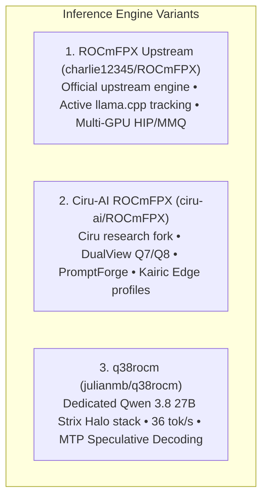

# ROCmFPX Automated Builds (AMD ROCm™ 7)

<div align="center">

[](https://github.com/Heretek-AI/ROCmFPX-BUILDER/releases/latest)
[](LICENSE)
[](https://github.com/ROCm/ROCm)
[](#-supported-devices)
[](#-supported-devices)

<p align="center">
  <b>High-performance automated nightly and on-demand builds of <a href="https://github.com/charlie12345/ROCmFPX">ROCmFPX (Upstream)</a>, <a href="https://github.com/ciru-ai/ROCmFPX">Ciru-AI ROCmFPX</a>, and <a href="https://github.com/julianmb/q38rocm">q38rocm</a> with built-in AMD ROCm™ 7 runtime libraries for Windows & Ubuntu.</b>
</p>

</div>

---

## ⚡ Supported Engine Variants

This repository provides automated build pipelines and release artifacts for three distinct ROCm inference engines:



### 1. **Upstream ROCmFPX** ([`charlie12345/ROCmFPX`](https://github.com/charlie12345/ROCmFPX))
The canonical, actively maintained upstream ROCmFPX project created by Charlie.
- Frequently synchronized with upstream `llama.cpp`.
- Multi-architecture HIP acceleration for AMD RDNA2, RDNA3, RDNA3.5, RDNA4, and CDNA.
- Standard high-performance MMQ/MMVQ dispatch.
- **Homebrew Formula**: `brew install rocmfpx`

### 2. **Ciru-AI ROCmFPX** ([`ciru-ai/ROCmFPX`](https://github.com/ciru-ai/ROCmFPX))
Ciru's specialized downstream research fork featuring low-bit quantization layouts:
- **ROCmFP2** (2.50 bpw), **ROCmFP3** (3.50 bpw), **ROCmFP4 / FAST** (4.50 / 4.25 bpw), **ROCmFP6** (6.50 bpw), **ROCmFP7 DualView** (7.50 bpw), and **ROCmFP8** (8.25 bpw).
- **DualView Architecture**: Authoritative Q7 storage with zero-copy Q7 decode streaming and exact signed-Q8 prefill shadow.
- **ActiveFPX PromptForge**: Prompt-specialized runtime featuring fused projections on Strix Halo (`gfx1151`).
- **Certified Profiles**: `kairic-edge` and `promptforge`.
- **Homebrew Formula**: `brew install ciru-rocmfpx`

### 3. **q38rocm** ([`julianmb/q38rocm`](https://github.com/julianmb/q38rocm))
Julian's dedicated deployment stack for **Qwen 3.8 27B** on **AMD Strix Halo (Ryzen AI Max+ 395 / Radeon 8060S)** APUs:
- Sustained **30.56 – 36.04 tok/s** generation throughput via MTP (Multi-Token Prediction) Speculative Decoding (K=4..6).
- **Asymmetric TurboQuant KV Cache** (`-ctk q8_0 -ctv turbo4`): Compresses 262K context RAM from 61.4 GB to 20.08 GB.
- **Mesa RADV Wave64 cooperative matrices** (`KHR_coopmat`).
- **Homebrew Formula**: `brew install q38rocm`

> [!IMPORTANT]  
> **⚡ Ready to Run — ROCm™ 7 Built-in**: All binaries include complete ROCm 7 runtime libraries, hipBLAS, rocBLAS, and hipBLASLt kernels with portable `$ORIGIN` RPATHs. **No separate AMD ROCm™ SDK or driver installation is required on Windows or Linux!**

---

## 🎯 Supported AMD GPU Targets

| Target Code | GPU Architecture | Target Hardware / Devices |
|---|---|---|
| **`gfx1151`** | **Strix Halo APU** (RDNA3.5) | AMD Ryzen AI MAX+ Pro 395, Ryzen AI MAX 390, Radeon 8060S |
| **`gfx1150`** | **Strix Point APU** (RDNA3.5) | AMD Ryzen AI 9 HX 370, Ryzen AI 9 365, Radeon 890M / 880M |
| **`gfx120X`** | **RDNA4 dGPUs** | AMD Radeon RX 9070 XT, RX 9070 GRE, RX 9070, RX 9060 XT, RX 9060 |
| **`gfx110X`** | **RDNA3 dGPUs & iGPUs** | Radeon PRO W7900 / W7800 / W7700, RX 7900 XTX / XT / GRE, RX 7800 XT, Radeon 780M / 760M |
| **`gfx103X`** | **RDNA2 dGPUs & Handhelds** | Steam Deck (Van Gogh), Radeon 680M, RX 6950 XT / 6800 XT / 6700 XT |
| **`gfx90a`** | **CDNA2 Accelerators** | AMD Instinct MI210, MI250, MI250X |
| **`gfx908`** | **CDNA1 Accelerators** | AMD Instinct MI100 |

---

## 🍺 Homebrew Tap Installation

Install directly via the [**Heretek-AI/homebrew-tap**](https://github.com/Heretek-AI/homebrew-tap):

```bash
# 1. Tap the repository
brew tap Heretek-AI/tap

# 2. Install Upstream ROCmFPX (charlie12345/ROCmFPX)
brew install rocmfpx

# Or install Ciru-AI ROCmFPX (DualView Q7 / PromptForge / Kairic Edge)
brew install ciru-rocmfpx

# Or install dedicated q38rocm (Qwen 3.8 27B @ 36 tok/s on Strix Halo)
brew install q38rocm
```

---

## 🚀 CI Workflows

- [`.github/workflows/build-rocmfpx.yml`](.github/workflows/build-rocmfpx.yml): Multi-OS, multi-GPU matrix builder for canonical upstream `charlie12345/ROCmFPX`.
- [`.github/workflows/build-rocmfpx-profile.yml`](.github/workflows/build-rocmfpx-profile.yml): On-demand certified builder for `ciru-ai/ROCmFPX` (`kairic-edge`, `promptforge`, DualView).
- [`.github/workflows/build-q38rocm.yml`](.github/workflows/build-q38rocm.yml): Dedicated Strix Halo `gfx1151` builder for `q38rocm`.

---

## 📄 License & Attribution

- **ROCmFPX (Upstream)**: Developed by Charlie ([charlie12345/ROCmFPX](https://github.com/charlie12345/ROCmFPX)) under the MIT License.
- **ROCmFPX (Ciru Fork)**: Developed by Ciru ([ciru-ai/ROCmFPX](https://github.com/ciru-ai/ROCmFPX)) under the MIT License.
- **q38rocm**: Developed by Julian ([julianmb/q38rocm](https://github.com/julianmb/q38rocm)) under the Apache 2.0 License.
- **llama.cpp**: Developed by Georgi Gerganov and contributors under the MIT License.
