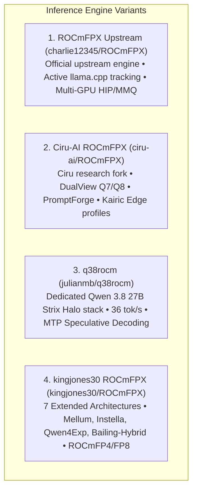

# ROCmFPX Automated Builds (AMD ROCm™ 7)

<div align="center">

[](https://github.com/Heretek-AI/ROCmFPX-BUILDER/releases/latest)
[](https://github.com/Heretek-AI/homebrew-tap)
[](LICENSE)
[](https://github.com/ROCm/ROCm)
[](#-supported-devices)
[](#-supported-devices)

<p align="center">
  <b>High-performance automated nightly and on-demand builds of <a href="https://github.com/charlie12345/ROCmFPX">ROCmFPX (Upstream)</a>, <a href="https://github.com/ciru-ai/ROCmFPX">Ciru-AI ROCmFPX</a>, <a href="https://github.com/kingjones30/ROCmFPX">kingjones30 ROCmFPX</a>, and <a href="https://github.com/julianmb/q38rocm">q38rocm</a> with built-in AMD ROCm™ 7 runtime libraries for Windows & Ubuntu.</b>
</p>

</div>

---

## ⚡ Supported Engine Variants

This repository provides automated build pipelines and release artifacts for four distinct ROCm inference engines:



### 1. **Upstream ROCmFPX** ([`charlie12345/ROCmFPX`](https://github.com/charlie12345/ROCmFPX))
The canonical, actively maintained upstream ROCmFPX project created by Charlie.
- Frequently synchronized with upstream `llama.cpp`.
- Multi-architecture HIP acceleration for AMD RDNA2, RDNA3, RDNA3.5, RDNA4, and CDNA.
- Standard high-performance MMQ/MMVQ dispatch.
- **Homebrew Formula**: `brew install rocmfpx`

### 2. **Ciru-AI ROCmFPX** ([`ciru-ai/ROCmFPX`](https://github.com/ciru-ai/ROCmFPX))
Ciru's specialized downstream research fork featuring low-bit quantization layouts:
- **ROCmFP2** (2.50 bpw), **ROCmFP3** (3.50 bpw), **ROCmFP4 / FAST** (4.50 / 4.25 bpw), **ROCmFP6** (6.50 bpw), **ROCmFP7 DualView** (7.50 bpw), and **ROCmFP8** (8.25 bpw).
- **DualView Architecture**: Authoritative Q7 storage with zero-copy Q7 decode streaming and exact signed-Q8 prefill shadow.
- **ActiveFPX PromptForge**: Prompt-specialized runtime featuring fused projections on Strix Halo (`gfx1151`).
- **Certified Profiles**: `kairic-edge` and `promptforge`.
- **Homebrew Formula**: `brew install ciru-rocmfpx`

### 3. **q38rocm** ([`julianmb/q38rocm`](https://github.com/julianmb/q38rocm))
Julian's dedicated deployment stack for **Qwen 3.8 27B** on **AMD Strix Halo (Ryzen AI Max+ 395 / Radeon 8060S)** APUs:
- Sustained **30.56 – 36.04 tok/s** generation throughput via MTP (Multi-Token Prediction) Speculative Decoding (K=4..6).
- **Asymmetric TurboQuant KV Cache** (`-ctk q8_0 -ctv turbo4`): Compresses 262K context RAM from 61.4 GB to 20.08 GB.
- **Mesa RADV Wave64 cooperative matrices** (`KHR_coopmat`).
- **Homebrew Formula**: `brew install q38rocm`

### 4. **kingjones30 ROCmFPX** ([`kingjones30/ROCmFPX`](https://github.com/kingjones30/ROCmFPX))
King Jones's extended ROCmFPX fork providing native ROCmFP4 / ROCmFP8 tensor types paired with **7 model architectures**:
- **`mellum`**: Mellum2-12B-A2.5B (~96.92 tok/s).
- **`instella`**: AMD Instella-MoE-16B-A3B (~90 tok/s).
- **`bailing-hybrid`**: Ling-3.0 `*-base-*` (KDA + MLA hybrid, fixes compressed queries loader bug) (~36.6–42.3 tok/s).
- **`muse-glimmer`**: Muse-Glimmer-30B (~30 tok/s).
- **`qwen4exp`**: Qwen3.8-Flash-Next (345 tok/s prefill, 22.6 tok/s decode).
- **`zaya`**: ZAYA1-8B (~15.8 tok/s).
- **`cohere2moe`**: North-Mini-Code-1.0.
- **Homebrew Formula**: `brew install kingjones-rocmfpx`

> [!IMPORTANT]  
> **⚡ Ready to Run — ROCm™ 7 Built-in**: All binaries include complete ROCm 7 runtime libraries, hipBLAS, rocBLAS, and hipBLASLt kernels with portable `$ORIGIN` RPATHs. **No separate AMD ROCm™ SDK or driver installation is required on Windows or Linux!**

---

## 🎯 Supported AMD GPU Targets

| Target Code | GPU Architecture | Target Hardware / Devices |
|---|---|---|
| **`gfx1151`** | **Strix Halo APU** (RDNA3.5) | AMD Ryzen AI MAX+ Pro 395, Ryzen AI MAX 390, Radeon 8060S |
| **`gfx1150`** | **Strix Point APU** (RDNA3.5) | AMD Ryzen AI 9 HX 370, Ryzen AI 9 365, Radeon 890M / 880M |
| **`gfx120X`** | **RDNA4 dGPUs** | AMD Radeon RX 9070 XT, RX 9070 GRE, RX 9070, RX 9060 XT, RX 9060 |
| **`gfx110X`** | **RDNA3 dGPUs & iGPUs** | Radeon PRO W7900 / W7800 / W7700, RX 7900 XTX / XT / GRE, RX 7800 XT, Radeon 780M / 760M |
| **`gfx103X`** | **RDNA2 dGPUs & Handhelds** | Steam Deck (Van Gogh), Radeon 680M, RX 6950 XT / 6800 XT / 6700 XT |
| **`gfx90a`** | **CDNA2 Accelerators** | AMD Instinct MI210, MI250, MI250X |
| **`gfx908`** | **CDNA1 Accelerators** | AMD Instinct MI100 |

---

## 🍺 Homebrew Tap Installation

Install directly via the [**Heretek-AI/homebrew-tap**](https://github.com/Heretek-AI/homebrew-tap):

```bash
# 1. Tap the repository
brew tap Heretek-AI/tap

# 2. Install Upstream ROCmFPX (charlie12345/ROCmFPX)
brew install rocmfpx

# Or install Ciru-AI ROCmFPX (DualView Q7 / PromptForge / Kairic Edge)
brew install ciru-rocmfpx

# Or install dedicated q38rocm (Qwen 3.8 27B @ 36 tok/s on Strix Halo)
brew install q38rocm
```

---

## 🧠 Running Qwen 3.8 27B with 1M YaRN Context Extension

To run **Qwen 3.8 27B** with a **1,048,576 token (1M) context window** on AMD Strix Halo / ROCm using YaRN RoPE interpolation and 4-bit KV cache:

### 1. Using the Convenience Script
```bash
# Maximum generation speed (30–36 tok/s via Vulkan0 Mesa RADV Wave64 + MTP K=4/p=0.0):
./scripts/run_yarn_1m.sh -m /path/to/Qwen3.8-27B-ROCmFP4-STRIX_LEAN.gguf --profile speed

# Deterministic coding agents (34.82 tok/s strict MTP, cache isolated):
./scripts/run_yarn_1m.sh -m /path/to/Qwen3.8-27B-ROCmFP4-STRIX_LEAN.gguf --profile agent

# Multi-turn conversation with deep prompt caching (MTP=0, dense checkpoints):
./scripts/run_yarn_1m.sh -m /path/to/Qwen3.8-27B-ROCmFP4-STRIX_LEAN.gguf --profile cache

# Full 1M context via YaRN 4x scaling (default):
./scripts/run_yarn_1m.sh -m /path/to/Qwen3.8-27B-ROCmFP4-STRIX_LEAN.gguf --profile 1m
```

### 2. Direct `llama-server` CLI Invocation (1M Context)
```bash
HIP_VISIBLE_DEVICES=1 /home/linuxbrew/.linuxbrew/opt/q38rocm/bin/llama-server \
  --host 0.0.0.0 \
  --port 8800 \
  -m /home/ronin/Projects/models/Qwen-3.8-27B-ROCmFP4-FAST-GGUF/Qwen3.8-27B-ROCmFP4-STRIX_LEAN.gguf \
  --image-min-tokens 1024 \
  -ngl 99 \
  -fit off \
  -np 1 \
  -c 1048576 \
  --override-kv qwen35.context_length=int:1048576 \
  --rope-scaling yarn \
  --rope-scale 4.0 \
  --yarn-orig-ctx 262144 \
  --yarn-ext-factor -1 \
  --yarn-attn-factor 1.0 \
  --yarn-beta-slow 1 \
  --yarn-beta-fast 32 \
  -ctk q8_0 \
  -ctv turbo4 \
  -fa on \
  -b 2048 \
  -ub 2048
```

> **Parameter & Performance Notes:**
> - **Raw Decode vs MTP Speculative Decode**:
>   - **Raw Unassisted Decode** for Qwen 3.8 27B FP4 is physically memory-bandwidth bound on Strix Halo's 256-bit bus at **~13.90–14.02 tok/s**.
>   - Reaching **30.00–36.04 tok/s** requires **MTP Speculative Decoding** (`--spec-type draft-mtp --spec-draft-n-max 4 --spec-draft-p-min 0.0`).
> - **Backend Driver (`Vulkan0` vs `ROCm0`)**:
>   - `run_yarn_1m.sh` auto-detects `Vulkan0` (Mesa RADV Wave64 cooperative matrix `KHR_coopmat`), unlocking **34–36 tok/s** with MTP.
>   - ROCm HIP (`ROCm0`) caps MTP at **~28 tok/s**.
> - **Context Scaling Impact on Decode TPS**:
>   - Advertised 30–36 tok/s benchmarks were measured at **32K context with native RoPE**.
>   - At 50K+ tokens, streaming the active KV cache across unified memory consumes bandwidth, naturally lowering single-token decode speed.
> - `-c 1048576`: Allocates the 1M token context buffer.
> - `--override-kv qwen35.context_length=int:1048576`: Overrides GGUF metadata `n_ctx_train` for `qwen35` so `llama-server` initializes the full 1M slot context without capping at 262K.
> - `-fit off`: Disables automatic VRAM fitting when full layers (`-ngl 99`) are explicitly requested.
> - `--rope-scaling yarn --rope-scale 4.0`: Scales frequencies 4× from Qwen 3.8's native 262,144 base window (`--yarn-orig-ctx 262144`). Omitted in `speed`, `agent`, and `cache` profiles to preserve native attention resolution.
> - `-ctk q8_0 -ctv turbo4`: Asymmetric TurboQuant KV cache keeps keys in 8-bit for precise attention routing while compressing values to 4-bit, fitting 1M within 128 GB unified memory.
> - `-b 2048 -ub 2048`: Matching logical and physical micro-batch sizes maximizes ROCm HIP compute throughput during long-context prompt ingestion.
> - **Hybrid Recurrent Checkpoints**: Qwen 3.8 (`qwen35`) combines SSM layers with attention, meaning KV cells cannot be arbitrarily shifted. Context reuse relies strictly on RAM checkpoints. `run_yarn_1m.sh` configures 128 checkpoints (`--ctx-checkpoints 128`) spaced every 2,048 tokens (`--checkpoint-every-n-tokens 2048`) with `--cache-ram 32768`, guaranteeing fast ~5s rollbacks without dropping prompt cache.
> - **Multimodal Projector**: Disabled by default for pure text inference (`NO_MMPROJ=1`) to eliminate unsupported CLIP operator warnings and warmup overhead. Pass `--mmproj <path>` to attach for vision models.

---

## 🚀 CI Workflows

- [`.github/workflows/build-rocmfpx.yml`](.github/workflows/build-rocmfpx.yml): Multi-OS, multi-GPU matrix builder for canonical upstream `charlie12345/ROCmFPX`.
- [`.github/workflows/build-rocmfpx-profile.yml`](.github/workflows/build-rocmfpx-profile.yml): On-demand certified builder for `ciru-ai/ROCmFPX` (`kairic-edge`, `promptforge`, DualView).
- [`.github/workflows/build-q38rocm.yml`](.github/workflows/build-q38rocm.yml): Dedicated Strix Halo `gfx1151` builder for `q38rocm`.
- [`.github/workflows/build-kingjones-rocmfpx.yml`](.github/workflows/build-kingjones-rocmfpx.yml): Multi-target matrix builder for `kingjones30/ROCmFPX`.

---

## 📄 License & Attribution

- **ROCmFPX (Upstream)**: Developed by Charlie ([charlie12345/ROCmFPX](https://github.com/charlie12345/ROCmFPX)) under the MIT License.
- **ROCmFPX (Ciru Fork)**: Developed by Ciru ([ciru-ai/ROCmFPX](https://github.com/ciru-ai/ROCmFPX)) under the MIT License.
- **ROCmFPX (kingjones30 Fork)**: Developed by King Jones ([kingjones30/ROCmFPX](https://github.com/kingjones30/ROCmFPX)) under the MIT License.
- **q38rocm**: Developed by Julian ([julianmb/q38rocm](https://github.com/julianmb/q38rocm)) under the Apache 2.0 License.
- **llama.cpp**: Developed by Georgi Gerganov and contributors under the MIT License.
